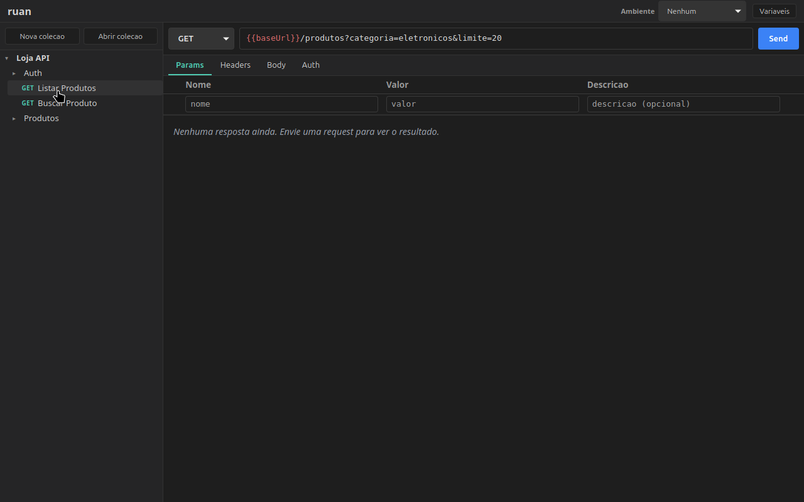

# ruan

Cliente HTTP / API **file-based**, feito em **Tauri v2 + Rust + React**, **otimizado pro Linux**.

## Features

### Milestone 1 — MVP

- [x] **F1 — Modelo de dados & formato em disco** (file-based, YAML, parse/stringify isolado, watcher)
- [x] **F2 — Gerenciar coleções** (criar / abrir / fechar; lista persistida entre sessões)
- [x] **F3 — Árvore de pastas e requests** (sidebar com CRUD, menu de contexto, drag-and-drop, badge de método)
- [x] **F4 — Request builder + envio** (método + URL + Send; engine HTTP no Rust com timeout e redirects)
- [x] **F5 — Editor de query params** (tabela ↔ URL, bidirecional, com enable/disable por linha)
- [x] **F6 — Editor de headers** (tabela com enable/disable e autocomplete de headers comuns)
- [x] **F7 — Editor de body** (none / json / text / xml / form-urlencoded / multipart / graphql, com CodeMirror e pretty-print)
- [x] **F8 — Viewer de resposta** (status, tempo, tamanho; abas Body/Headers/Cookies; highlight; busca; preview de imagem/PDF)

### Milestone 2 — Variáveis, ambientes e auth

- [x] **F9 — Environments & variáveis** (por coleção/global, com variáveis secret)
- [x] **F10 — Interpolação `{{var}}`** (URL, headers, params, body, auth, com precedência de escopo e realce inline)
- [x] **F11 — Autenticação** (Basic, Bearer, API Key, OAuth2; herança de pasta/coleção)

### Milestone 3 — Scripting, testes e produtividade

- [x] **F12 — Scripts pre-request e post-response** (JS sandbox; API `ruan.setVar/getVar/setEnvVar/getEnvVar`, acesso a `req`/`res`)
- [x] **F13 — Testes / assertions** (painel pass/fail por request)
- [x] **F14 — Cookie jar** (Set-Cookie por domínio, reenvio automático)
- [x] **F15 — Tabs / multi-request** (abas com indicador de não-salvo, atalhos)
- [x] **F16 — Histórico de execuções** (lista cronológica com replay)

### Milestone 4 — Interoperabilidade e extras

- [x] **F17 — Import / Export** (Postman, OpenAPI, cURL)
- [x] **F18 — Code generation** (cURL, fetch, axios, Python requests)
- [x] **F19 — Busca global & command palette** (Ctrl+K)
- [x] **F20 — Settings** (proxy, SSL verify, timeout, tema; overrides por request)

### Integração com IAs (MCP)

- [x] **Servidor MCP (`ruan-mcp`)** — uma IA cria e edita coleções, pastas e requests (9 tools `ruan_*`) direto nos arquivos `.yml`
- [x] **Painel "IA / MCP" no app** — autoconfigura o Claude Code / Claude Desktop em um clique
- [x] **Sync ao vivo** — mudanças no disco (MCP, edição externa, `git pull`) refletem na sidebar em tempo real
