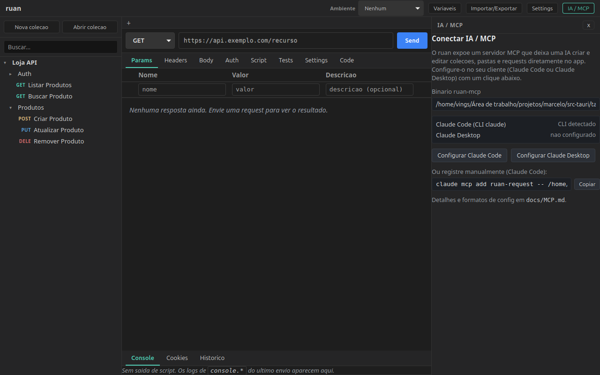

# Servidor MCP do ruan (`ruan-mcp`)

O ruan inclui um servidor **MCP** (Model Context Protocol) que permite a uma IA
(Claude Code, Claude Desktop, ou qualquer cliente MCP) **criar e editar coleções,
pastas e requests** operando direto nos arquivos `.yml` do disco — sem precisar
abrir o app gráfico.

Como toda a persistência do ruan é file-based, o servidor reusa exatamente a mesma
lógica de disco do app (módulo `store`): sanitização de nomes (slug), validação
anti path-traversal e limite de tamanho de leitura valem igual. A IA não consegue
escrever fora do diretório da coleção declarada.

## Configuração pelo app (1 clique)

O ruan tem um painel **IA / MCP** no header que detecta o binário, mostra o status
e configura o Claude Code / Claude Desktop num clique:



## Como funciona

- Binário standalone `ruan-mcp`, transporte **STDIO** com **JSON-RPC 2.0**
  (uma mensagem por linha).
- `stdout` é exclusivo do protocolo; todo log/diagnóstico vai para `stderr`.
- `protocolVersion`: `2024-11-05`. `serverInfo.name`: `vings-request`.
- A lógica das tools vive em `ruan_lib::mcp` (testável via `cargo test`); o binário
  (`src-tauri/src/bin/ruan-mcp.rs`) só cuida do transporte.

## Tools expostas

Todas têm prefixo `ruan_`. `dir`/`fromDir`/`toDir` são subcaminhos **relativos
dentro da coleção** (slugs unidos por `/`); ausentes = raiz da coleção.

| Tool | Argumentos | Faz |
|---|---|---|
| `ruan_open_collection` | `{ path }` | Abre a coleção e devolve a árvore completa (pastas + requests). |
| `ruan_create_collection` | `{ parentDir, name }` | Cria `<parentDir>/<slug(name)>/` com `collection.yml`. |
| `ruan_create_folder` | `{ collectionPath, dir?, name, seq? }` | Cria uma subpasta (com `folder.yml`). |
| `ruan_create_request` | `{ collectionPath, dir?, name, method?, url?, headers?, params?, body?, auth?, seq? }` | Cria uma request (sem method/url começa GET vazia). |
| `ruan_update_request` | `{ collectionPath, dir?, name, patch }` | Patch parcial: carrega do disco, mescla os campos do `patch`, regrava. Renomear via `patch.name` move o arquivo. |
| `ruan_rename_item` | `{ collectionPath, dir?, kind, oldName, newName }` | Renomeia uma request ou pasta (`kind`: `request`/`folder`). |
| `ruan_duplicate_item` | `{ collectionPath, dir?, name, newName?, seq? }` | Duplica uma request (`newName` default `"<name> copia"`). |
| `ruan_move_item` | `{ collectionPath, kind, fromDir?, toDir?, name, newSeq? }` | Move/reordena uma request ou pasta entre diretórios. |
| `ruan_delete_request` | `{ collectionPath, dir?, name }` | Remove uma request pelo nome (idempotente). |

Campos do `patch` em `ruan_update_request`: `name`, `seq`, `method`, `url`,
`headers`, `params`, `body`, `auth`, `scripts`, `tests`, `docs`. Apenas os
presentes mudam; um patch malformado vira erro **antes** de gravar, nunca corrompe
o `.yml`.

Erros de tool voltam como `isError: true` no resultado MCP (a IA vê a mensagem);
erros de protocolo usam os códigos JSON-RPC (`-32700` parse, `-32601` método
inexistente, `-32602` params inválidos).

## Buildar

```bash
cd src-tauri
cargo build --release --bin ruan-mcp
# binário em: src-tauri/target/release/ruan-mcp
```

Para desenvolvimento, `cargo build --bin ruan-mcp` gera em `target/debug/ruan-mcp`.

## Registrar na Claude Code

Aponte para o binário compilado (sem argumentos):

```bash
claude mcp add vings-request -- /caminho/absoluto/para/src-tauri/target/release/ruan-mcp
```

Depois, dentro de uma sessão, peça à IA coisas como "abra a coleção em
`/home/me/apis/minha-api` e crie uma request POST chamada Login em
`/auth/login`". A IA chamará as tools `ruan_*`.

## Registrar manualmente (`.mcp.json` / Claude Desktop)

No `.mcp.json` do projeto ou no `claude_desktop_config.json`:

```json
{
  "mcpServers": {
    "vings-request": {
      "command": "/caminho/absoluto/para/src-tauri/target/release/ruan-mcp"
    }
  }
}
```

## Empacotamento `.mcpb` (Claude Desktop)

Para distribuir o servidor como uma extensão one-click no Claude Desktop, dá para
empacotar o binário `ruan-mcp` num bundle `.mcpb` (manifest + binário). A ideia é
gerar um `manifest.json` apontando o `command` para o binário embutido e zipar como
`.mcpb`; o usuário instala arrastando o arquivo. Como o binário já é standalone e
sem dependências de runtime, o bundle é só o executável + manifest. (Não incluído
no repositório por enquanto; o caminho suportado hoje é `claude mcp add`.)

## Modelo de confiança

- `collectionPath`/`parentDir` são território declarado da IA: ela já tem o poder de
  filesystem do processo (é um servidor local single-user). Isso é esperado.
- `dir`/`fromDir`/`toDir` e todos os `name` são validados componente a componente
  via a sanitização da store (`slug_seguro`: rejeita `..`, `.`, `/`, `\`, NUL,
  caminhos absolutos), com `dentro_de` como defesa em profundidade — então a IA
  **não** consegue escrever/mover/apagar fora da coleção via esses campos.
- Leitura de `.yml` tem teto de tamanho (10 MiB); cada linha JSON-RPC do stdin tem
  teto de 16 MiB.
